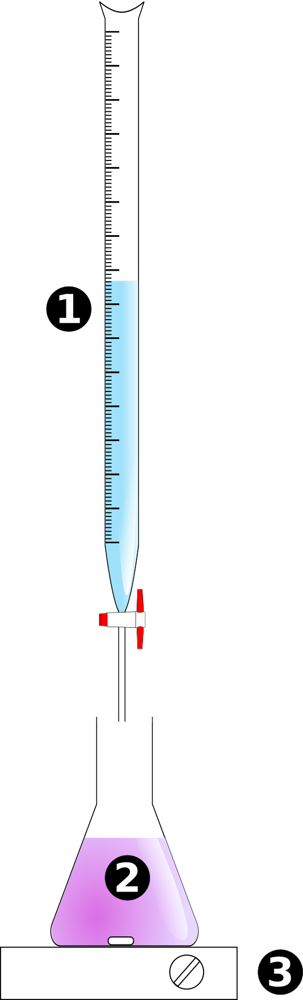

# C4 : Détermination d’une quantité de matière par titrage

Un titrage est une méthode de *dosage* d'une espèce chimique. On dit qu'elle est *destructive* car l'espèce dosée est chimiquement transformée. 

## 1. Le principe de la méthode.

On dispose :

* d’une solution **inconnue** dont on veut déterminer la concentration d’une espèce qu’elle contient, c’est la solution **titrée**.
* d’une solution **connue** contenant une espèce capable de réagir avec la solution précédente, c’est la solution **titrante**.

**Hypothèses:** On supposera cette année que l’une des solutions (titrante ou titrée) est **colorée** et que la transformation chimique est **totale.**

> **Principe :**  On verse la solution titrante dans la solution titrée par petits ajouts successifs jusqu’à ce que la couleur du mélange change.

## 2. Le montage expérimental.

* La solution titrante est placée dans une **burette**  (1) 
* La solution titrée est placée dans un bécher ou un **erlenmeyer**  (2)
* Un barreau aimanté permet d’homogénéiser la solution (3) de façon à mieux repérer **le changement de couleur.**

> Au moment où la couleur change, on note le volume versé sur la burette, c’est le volume **à l'équivalence**. On le note $V_{éq}$

## 3. L’équivalence du titrage.
#### Aspect qualitatif.

On raisonne sur le système chimique contenu dans erlenmeyer.

- Au début du titrage, le réactif limitant est le réactif titrant puisque la couleur n'a pas encore changée.
- À la fin du titrage, le réactif limitant est le réactif  titré puisque qu’il y a eu un changement de couleur.
- **L'équivalence** correspond au moment où se produit le changement de couleur.

#### Aspect quantitatif.
**À l’équivalence** les réactifs ont été mis en présence dans les proportions stœchiométriques. 

> Pour une réaction de titrage, d’équation $aA+bB\rightarrow cC+dD$
> Lorsque les quantités de matière des réactifs mises en présence **à l’équivalence** sont  $n(A)$ et $n(B)$, on a la relation:
> $$
> \frac{n\left(A\right)}{a}= \frac{n\left(B\right)}{b}
> $$

**NB:** Cette relation peut être obtenue avec un tableau d'avancement.