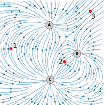
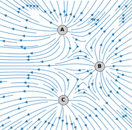
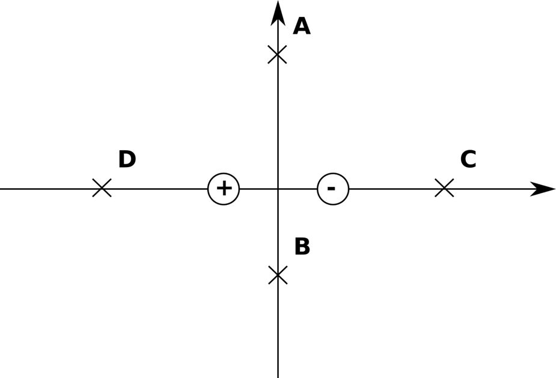
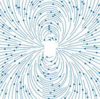

# Exercices P1

## Exercice 1: Charges et pendule

On frotte une baguette de verre avec une peau de chat. La charge portée par la baguette est de $5\ nC $
Donnée : charge élémentaire $ e = 1,6.10^{-19}\  C$

1.	Combien de charges élémentaires porte la baguette ? 
2.	Quelle est la valeur de la charge électrique portée par la peau de chat ?
3.	La baguette de verre est capable d’attirer une petite bille d’aluminium suspendue à l’aide d’un fil. Expliquer pourquoi. (il est possible de représenter les charges sur le schéma)

## Exercice 2: Atome d'hydrogène

L’atome d’hydrogène est constitué d’un proton de charge +e et de masse $1,67×10^{-27}\ kg$ autour duquel se trouve un électron de charge  – e et de masse $9,11×10^{-31}\ kg$. La distance moyenne entre les deux particules est de 53 pm.
Données : La constante de Coulomb : $k=9,0.10^9\  Nm^2C^{-2}$; constante gravitationnelle : $G=6,67.10^{-11}\ Nm^2kg^{-2}$

1.	Quel est la direction et le sens de la force gravitationnelle exercée par le proton sur l’électron ?
2.	Calculer sa valeur.
3.	Quelle est la direction et le sens de la force électrostatique exercée par le proton sur l’électron ?
4.	Calculer sa valeur.
5.	Comparer les valeurs des deux forces et conclure.

## Exercice 3: Noyau d'hélium

Le noyau d’hélium est constitué de 2 protons et 2 neutrons que l’on suppose sphériques et au contact avec les centres dans le même plan comme sur le schéma ci-contre. 

**Données** Le proton et le neutron ont une même masse $m =1,67.10^{-27}\ kg$ et un même rayon $R=1,2.10^{-15}\ m$
Charge élémentaire: $e = 1,6.10^{-19} C$ ; Constante de Coulomb $k=9,0.10^9 Nm^2C^{-2}$ ; Constante gravitationnelle $G = 6,67.10^{-11} Nm^2kg^{-2}$ 

1. Montrer, à l'aide du schéma, que la distance entre un proton et un neutron est $2R$ alors que la distance entre deux protons est $2R\sqrt{2}$
1. Calculer la valeur de la force électrostatique entre 2 protons. Est-elle attractive ou répulsive ?
1. Pourquoi n’y a-t-il pas d’interaction électrostatique entre le proton et le neutron ?
1. Calculer la valeur de la force gravitationnelle entre 2 protons. Est-elle attractive ou répulsive ?
1. Pourquoi l’interaction gravitationnelle est la même entre un proton et un neutron ?
1. Dans ce noyau, l’interaction électrostatique est bien plus grande que l’interaction gravitationnelle. Que devrait-il se passer ?

## 4. Champs électrostatiques

On disposes 3 charges notées A,B et C., déterminer leurs signes pour les deux situations ci-contre (les traits sont des lignes de champs).

Représenter sans échelle :
- le vecteur champ électrostatique au point 1.
- la force exercée sur une charge positive que l’on place au point 2.
- la force exercée sur une charge négative placée au point 3.

## 5. Champ d'un dipôle.

Un dipôle est constitué de deux charges de signes opposés proches l’une de l’autre, comme sur le schéma ci-dessous. On cherche à déterminer la direction et le sens du champ en quelques points.

1. Représenter (sans échelle) le champ $\vec E_1$ créé par la charge positive au point A.
2. Représenter le champ $\vec E_2 $ créé par la charge négative au point A de façon     cohérente.
3. Représenter le champ des deux charges en A en construisant $\vec E_1 + \vec E_2$
4. Procéder de la même façon pour le point  B.
5. Tracer approximativement les champs en C et D.
6. Comparer vos réponses avec les lignes de champ du document ci-dessous et conclure.

## Exercice 6: Champ gravitationnel terrestre.

**Données :** Masse de la Terre $m_T = 5,97×10^{24}\ kg$, Constante gravitationnelle 
$G = 6,67.10^{-11} Nm^2kg^{-2}$  Le rayon de la Terre est de 6380 km.

1. Écrire l’expression vectorielle de la force gravitationnelle exercée par la Terre T de masse mT sur un point P de masse m. On notera $\vec{u}$ le vecteur unitaire dirigé de P vers T
2. En déduire l’expression vectorielle du champ gravitationnel exercée par la Terre au point M.
3. Calculer la valeur du champ gravitationnel au niveau du sol (altitude 0), et à 10 km d’altitude, puis conclure.
4. À quelle altitude le champ de gravitation est deux fois plus petit qu’au niveau du sol ?

