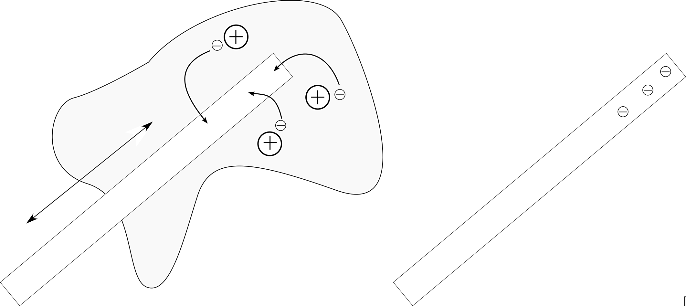
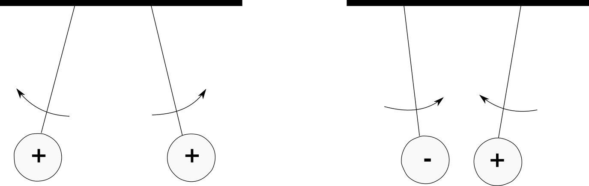
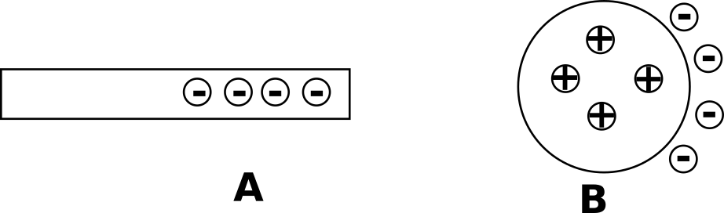
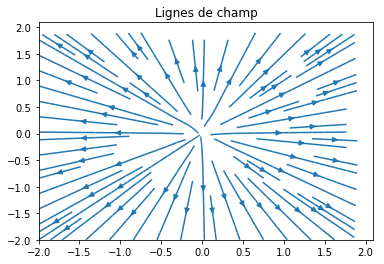
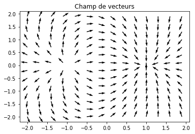

---

---

# P1 : Interactions fondamentales et notion de champ. 
## 1. L’interaction électrostatique.

### A. Charges et interactions électrostatique

* Un objet isolant peut acquérir des propriétés **électrique** , on dit qu’il porte des charges électriques (ou qu’il est électrisé) 

* L’expérience montre qu’il existe deux types  de charges électriques, notées + et -

* Les charges de même signe (document 2) se repoussent, et celle de signe contraire s'attirent. 

* Un objet électrisé (document 3) est capable de séparer les charges électrique d’un objet qui est proche de lui par influence.

### B. Loi de Coulomb.

> La force électrostatique exercée par une charge $q_A$ sur une charge $q_B$  placée à une distance $d$ est : 
> $$
> \fbox {$\vec{F}_{A/B}=\frac{k\times q_A\times q_B}{d^2}\vec{u}_{A/B}$}
> $$
> Où $q_A$ et $q_B$ sont les charges en coulomb (C)  $d$ la distance en mètre (m), et $F$ la force en Newton et $\vec{u}_{A/B}$ est le vecteur unitaire dirigé de A vers B et k est une constante $8,99×10^9\ N.m^2C^{-2}$

**Remarque :**

| Si les charges sont de même signe: | Si les charges sont de signes opposés:
|:-:|:-:|
la force est **répulsive**  car  $q_A × q_B > 0 $  |  la force est **attractive**  car  $q_A × q_B < 0$  |
| ||

**Attention**: 

* Ne pas confondre une force et sa norme ! Une force est un vecteur et la norme est sa valeur. $\vec{F}\neq F\ ! $
* La norme d’un vecteur est toujours *positive*. Il faut donc utiliser une valeur absolue pour être sûr de ne pas avoir une valeur négative $F\ =\frac{|k\times q_A\times q_B|}{d^2}$

### C. L’interaction gravitationnelle.
  Tous les objets s’attirent les uns les autres en raison de leur masse.

> **Loi de Newton :** La force gravitationnelle exercée par un point de masse $m_A$ sur un point de masse $m_B$ placé à une distance $d$ est :
>$$
\fbox{${\vec F}_{A/B}=-\frac{G\times m_A\times m_B}{d^2}{\vec{u}}_{A/B}$}
$$
> avec $m_A$ et $m_B$ les masses en kilogramme (kg)  d la distance en mètre (m), $\vec{u}_{A/B}$ vecteur unitaire dirigé de A vers B et $G = 6,67\times10^{-11}\ N.m^2.kg^{-2}$ est la constante gravitationnelle.

**Remarques : **

* La loi de Newton est valable pour des corps sphériques (planètes) à condition d'utiliser la distance en les centres.
* Comme les masses sont toujours positives, la force gravitationnelle est **attractive**
* Les lois de Newton de Coulomb ont la même forme mathématique, car elles sont **inversement proportionnelles au carré de la distance.**

## 2. Notion de champ.

Lorsque deux points A et B sont en interaction à distance, deux  *interprétations* sont possibles :
* Dire que B subit la force directement **exercée par A** à distance.
* Ou dire que A créé un champ autour de lui, et B subit une force **exercée par le champ** au point où il se trouve.

### A. Champ de gravitation.

Lorsque deux points A et B sont en interaction gravitationnelle, on peut dire soit :
* que B subit la force **exercée par A**:  ${\vec{F}}$
* que B subit la force **exercée par le champ** $\vec{\zeta}$ qui existe au point où il se trouve 
  **Remarque**: ce champ est créé par A.

> **Généralisation :** Un point M de masse $m$ placé dans une zone de l’espace où existe un champ gravitationnelle, $\vec{\zeta}$, subit une force gravitationnelle : $\fbox{$\vec{F}=m . \vec{\zeta}$}$

### B. Champ électrostatique.
Le principe est le même : la présence de charges électriques créé un champ électrostatique $\vec{E}$ dans l’espace

> **Généralisation :** Un point M de charge q placé dans une zone de l’espace où il y a un champ électrostatique, $\vec{E}$ subit une force électrostatique $\fbox{$ \vec{F}=q . \vec{E}$}$

**Remarque**: Si q > 0, la force est de même sens que le champ $\vec{E}$,  si q < 0 la force est opposée au champ.

### C. Exemples

### D. Lignes de champ.

Les champs gravitationnel ou électrostatique sont vectoriels, pour les représenter dans une zone de l’espace, on dessine soit :

| les champs en différents points                              | les lignes de champs             |
| ------------------------------------------------------------ | -------------------------------- |
|  |  |

**Exemple 1 :** Champ électrostatique d’une charge positive.

| les champs en différents points                              | les lignes de champs                |
| ------------------------------------------------------------ | ----------------------------------- |
|  |  |

**Exemple 2 :** Champ électrostatique de deux charges de signes différents.
