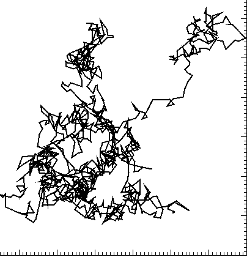

# P2 : Description d’un fluide au repos.

## 1. Grandeurs macroscopiques.

Un fluide est un *liquide* ou un *gaz*. 

### A. Aspect microscopique.

**Rappel:**  L'échelle microscopique est celle des atomes et des molécules

* À l’échelle microscopique, un fluide est constitué de particules (atomes ou molécules) qui se déplacent les unes par rapport aux autres à grande vitesse: c'est **l'agitation thermique.**
*  Chaque particule est animée d’un mouvement imprévisible en raison des nombreux **chocs** qu’elle subit.

### B. Aspect macroscopique.

**Rappel:** L'échelle macroscopique est notre échelle.

#### Grandeurs macroscopiques

À l’échelle macroscopique, on décrit un fluide à l’aide de grandeurs physiques faciles à mesurer, par exemple :

* la **masse volumique** $\rho$ $(kg.m^{-3})$
* la **température** (T en kelvin)
* la **pression** (P en Pa) 

#### Pression 
L'ensemble des chocs des particules d’un fluide sur une paroi d’un récipient créent une force appelée **force pressante** $\vec F$.

Cette force est toujours perpendiculaire à la surface et dirigée vers l'extérieur.

> Définition: La pression due à une force exercée sur une surface d’aire S est :
> $$
> \fbox{$p=\frac{F}{S}$}
> $$
> avec F en (N), p en (Pa) et S en (m²)

L’air qui nous entoure exerce une pression appelée pression atmosphérique. Sa valeur est de l’ordre de 1013 hPa et diminue avec l’altitude.

## 2. Loi de Mariotte

Les grandeur macroscopiques ne sont pas indépendantes les unes des autres.

> Pour une quantité de gaz fixe  à température constante, on a :
>$$
> \fbox{$p\times V=constante$}
> $$

* On dit que la pression est inversement proportionnelle au volume. 
  **Attention**: La constante dépend de la température et de la quantité de gaz.	
* toutes les combinaisons d'unités sont possibles.

## 3. Loi fondamentale de la statique des fluides

> Dans un fluide **incompressible** au repos, la pression augmente avec la profondeur.
> $$
> \fbox{$p_B-p_A=\rho\times g\times\left(z_A-z_B\right)$}
> $$
> Avec p la pression (Pa), z l’altitude (m) et $\rho$ la masse volumique du fluide en $kg.m^{-3}$ et g l'intensité de la pesanteur $9,81\ N.kg^{-1}$

**Attention :** Pour un liquide en contact avec l'air la pression a sa surface est la pression atmosphérique.