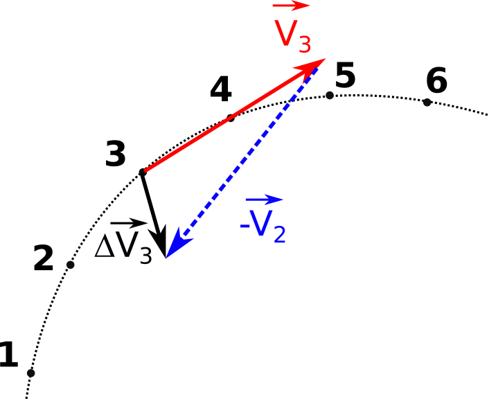

# P3: Mouvement d’un système.

## 1. Vecteur vitesse.

>**Définition:** Un point M se déplace et passe par différentes positions notées $M_i$ avec un intervalle de temps $\Delta t$. La vitesse pour la position $M_i$ peut être calculée par: 
>$$
>\fbox{$\vec{v_i} = \frac{\overrightarrow{M_i M_{i+1}}}{\Delta t}$}
>$$

**Remarque importante:** En terminale on préfère utiliser le point qui précède et le point suivant pour le calcul.

**Méthode générale** de construction d’un vecteur vitesse. 

Par exemple, comment tracer le vecteur $\vec v_3$ ?
1. on mesure la distance entre les point 3 et 4
1. on calcule la norme de la vitesse soit $v_3 = \frac{d}{\Delta t}$
1. à l'aide d'une échelle des vitesses on calcule la taille du vecteur à tracer.
1. on dessine un vecteur qui part du point 3 dont la direction est celle de $M_3 M_4$ dont la taille est celle calculé.

## 2. Vecteur variation de la vitesse.

>**Définition :** Le vecteur variation de la vitesse au point $M_i$ est :
>$$
>\fbox{ $\Delta \vec {v_i} = \vec v_i - \vec v_{i-1} $}
>$$

**Interprétation:** Ce vecteur nous indique de "combien la vitesse a changé" depuis le point précédent.

**Méthode générale** de construction du vecteur variation de la vitesse.

Par exemple, comment construire $\Delta \vec{v_3}$ ?

1. on translate (glisse) le vecteur $- \vec v_2$ à la suite du vecteur $\vec{v_3}$
2. on trace le vecteur somme des deux.
3. (optionnel) on mesure la taille du vecteur pour avoir sa valeur à l'aide de l'échelle.

 

## 3. Relation entre variation de la vitesse et forces.

> **Définition:** On admet qu’entre deux instants proches de durée $\Delta t (s)$ , la variation du vecteur vitesse est égale à la somme des forces exercées sur le système de masse m (kg)
>$$
> \fbox{$ m. \Delta \vec{v} = \Sigma \vec F . \Delta t $}
> $$

**Remarque:** La relation exacte sera vue en terminale.

